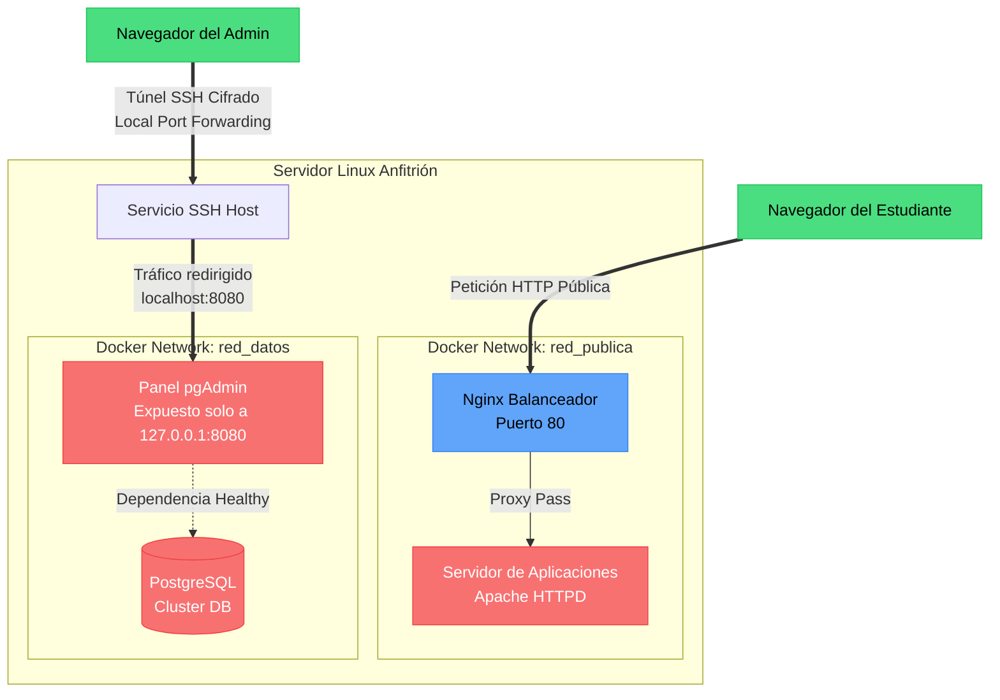

# Guía de Implementación - Práctica 11: Orquestación e Infraestructura como Código (IaC)

Esta guía te llevará paso a paso para levantar tu infraestructura orquestada de contenedores cumpliendo con todos los lineamientos de abstracción, seguridad perimetral y túneles SSH de la **Práctica 11**.

Todas las configuraciones ya están preparadas en esta carpeta (`Practica-11`).

## 📁 Archivos Preparados

1. **`docker-compose.yml`**: Contiene la definición de tus 4 servicios (nginx, webapp, postgres_db, pgadmin), tus dos redes (pública e interna) y la política de persistencia y salud.
2. **`.env`**: Archivo oculto que almacena tus credenciales (usuarios, contraseñas y puertos). ¡Cero contraseñas quemadas en el código!
3. **`nginx.conf`**: Configuración para tu balanceador de carga que redirige el tráfico al servidor secundario y oculta las versiones del servidor por seguridad (`server_tokens off`).

---

## 🚀 PASO 1: Levantar la Infraestructura

1. Abre la terminal de tu máquina servidor **Linux** (ej. Mageia).
2. Sube esta carpeta (`Practica-11`) a tu servidor Linux.
3. Entra a la carpeta usando la terminal:
   ```bash
   cd ruta/a/tu/Practica-11
   ```
4. Ejecuta el comando para crear y levantar todos los contenedores en segundo plano:
   ```bash
   docker-compose up -d
   ```
5. Verifica que todos los contenedores estén corriendo y que la base de datos esté "healthy":
   ```bash
   docker-compose ps
   ```

---

## 🗺️ Diagrama de Flujo de Datos

Para tu reporte, aquí tienes el código en **Mermaid** que genera el diagrama de flujo. Pégalo en [Mermaid Live Editor](https://mermaid.live/) para obtener la imagen, o simplemente déjalo así si tu editor soporta Markdown + Mermaid:



---

## 🧪 PASO 2: Protocolo de Pruebas de Aceptación (Para el Reporte)

Debes tomar capturas de pantalla de estas 4 pruebas.

### Prueba 11.1: Validación de Aislamiento de Red
El objetivo es demostrar que la base de datos y el panel no están accesibles directamente desde tu PC.
1. Abre la terminal de tu máquina física (Windows) o tu navegador.
2. Ejecuta un curl a la IP de tu servidor Linux en el puerto 5432 (Postgres) o en el 8080 (pgAdmin).
   ```bash
   curl http://IP_DE_TU_LINUX:8080
   ```
3. **Resultado Esperado**: La conexión debe ser rechazada (`Connection refused` o `Timeout`). *Toma captura*.

### Prueba 11.2: Validación de Resolución Interna DNS
Demostrarás que los contenedores se comunican por nombre (IaC) y no por IP.
1. Entra al contenedor de Nginx en el servidor Linux:
   ```bash
   docker exec -it proxy_nginx sh
   ```
2. Haz ping al contenedor secundario por su nombre de servicio:
   ```bash
   ping webapp
   ```
3. **Resultado Esperado**: El ping debe responder mostrando la IP interna de Docker que se le asignó dinámicamente. *Toma captura*. Escribe `exit` para salir del contenedor.

### Prueba 11.3: Validación de Túnel Cifrado de Gestión
El paso maestro. Te conectarás al panel oculto a través de SSH.
1. En la terminal de tu **PC local (Windows)**, ejecuta el comando de túnel SSH:
   ```bash
   ssh -L 8080:127.0.0.1:8080 usuario_linux@IP_DE_TU_LINUX
   ```
   *(Cambia `usuario_linux` e `IP_DE_TU_LINUX` por los datos reales de tu servidor Mageia)*.
2. Una vez que inicies sesión en la terminal de forma exitosa, NO la cierres. Minimízala.
3. Abre tu navegador web en Windows y entra a: `http://localhost:8080`
4. **Resultado Esperado**: Te cargará la interfaz gráfica de **pgAdmin 4**.
   *(Puedes iniciar sesión con `admin@empresa.local` y contraseña `AdminPgSecure2026!` que definimos en el .env).* *Toma captura*.

### Prueba 11.4: Validación de Persistencia y Buen Funcionamiento
Demuestra que los volúmenes funcionan y que el orden de arranque está asegurado por el `healthcheck`.
1. En tu servidor Linux, detén y destruye todo:
   ```bash
   docker-compose down
   ```
2. Inicia todo de nuevo forzando la vista de los logs para ver el orden:
   ```bash
   docker-compose up -d
   docker-compose logs -f pgadmin
   ```
3. **Resultado Esperado**: El log de pgAdmin tardará unos segundos en aparecer, porque esperará pacientemente a que PostgreSQL responda que está sano (`healthy`). Además, si creaste alguna base de datos en el panel, seguirá existiendo. *Toma captura del log donde se ve que arranca correctamente o del `docker-compose ps`.*

---
¡Listo! Con esto tienes la infraestructura como código montada, asegurada mediante defensa en profundidad y lista para el reporte.
